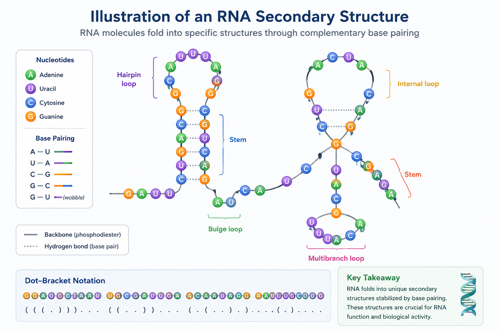

# Optimization of mRNA Secondary Structure Prediction Using Quantum Computing


> **WISER Global Quantum+AI Program 2026** — Moderna Challenge
> **Repository:** [`Moderna-Quantum-RNA-`](https://github.com/Harold-Ohandja/Moderna-Quantum-RNA-)

### ▶ [**Live interactive explainer →**](https://harold-ohandja.github.io/Moderna-Quantum-RNA-/)

A one-page, no-install walkthrough of what this project does and what we found, built for a general audience. Open it first if you want the story before the code; read on for the full technical depth.

---

## Team & Contributions

- **Pushkar Kumar** (pushkarkumar0997@gmail.com) — Quantum solver implementation (CVaR-VQE, QAOA), classical baseline solvers (brute-force and greedy heuristic), benchmarking notebooks and the unified comparison, the noise-robustness study, the interactive web explainer and report preparation completion.
- **Harold Ohandja** (harold.ohandja@aims-cameroon.org) — QUBO/Ising formulation and core modules, project direction and roadmap, quantum resource and scaling analysis,interactive web explainer ideation, report initialization and benchmark tooling.

---

## Objectives

- Understand the biological principles of RNA secondary structure.
- Generate classical benchmark structures using ViennaRNA.
- Formulate RNA folding as an optimization problem.
- Encode the optimization problem into a QUBO/Ising model.
- Implement a quantum (or quantum-inspired) optimization algorithm.
- Compare quantum predictions against classical MFE structures.
- Analyze the scalability and quantum resource requirements.

## High-Level Summary

- **Biological problem:** predicting the 2D Minimum Free Energy (MFE) folding configuration of therapeutic mRNA sequences.
- **Computational challenge:** the configuration space grows exponentially with sequence length, and once pseudoknots are allowed the problem becomes NP-hard.
- **Proposed quantum approach:** a QUBO base-pair interaction model solved with hybrid quantum–classical algorithms (`CVaR-VQE` and `QAOA`) in Qiskit, benchmarked against ViennaRNA.

> **Scope note:** the goal, per the challenge, is **not** to beat classical methods. It is to reproduce known structures for small sequences and understand how quantum resources scale with length.

### Headline findings (documented honestly)

- On some sequences (e.g. `GCGCAUACGC`) the quantum method reproduces the **exact** MFE structure, zero energy gap.
- On others (e.g. `AUGCAUGC`, `GCAUCGUAGC`) **every** method misses, *including exhaustive brute force*. Because brute force cannot beat the QUBO it is given, this isolates a **QUBO formulation gap**, not a weak optimizer — the distinction a benchmark exists to reveal.
- Under simulated shot noise and depolarizing gate noise, the correct fold **survives across the full range tested** (notebook 05).

---

## Table of Contents

1. [Why This Approach](#why-this-approach)
2. [Getting Started](#getting-started)
3. [Introduction](#1-introduction)
4. [Theoretical Background and Related Work](#2-theoretical-background-and-related-work)
5. [QUBO Formulation](#3-qubo-formulation)
6. [Quantum Algorithms](#4-quantum-algorithms)
7. [Repository Structure](#5-repository-structure)
8. [What to Expect When You Run It](#6-what-to-expect-when-you-run-it)
9. [Testing & Reproducibility](#testing--reproducibility)
10. [Bonus / Optional Tasks](#7-bonus--optional-tasks)
11. [Limitations and Future Work](#limitations-and-future-work)
12. [Deliverables](#deliverables)
13. [References](#references)

---

## Why This Approach

We chose a **QUBO + CVaR-VQE** pipeline deliberately, over the other options the challenge allowed (plain VQE, QAOA, quantum annealing, tensor-network methods):

- **It mirrors the sponsor's own validated method.** Moderna and IBM Quantum solved this exact problem with CVaR-VQE (Alevras et al., 2024), validating up to 60 nt against classical CPLEX. Building on a peer-reviewed, sponsor-authored approach is stronger than inventing a weaker formulation from scratch.
- **CVaR-VQE is robust where plain VQE struggles.** RNA folding produces a rugged combinatorial energy landscape. By optimising only the best 10% of sampled bitstrings each iteration (α = 0.1), CVaR resists getting trapped in poor local minima, unlike standard expectation-value VQE.
- **QUBO gives a clean classical cross-check.** Because the same QUBO can be solved exactly by brute force for small instances, we can tell a formulation error apart from a solver error — which turned out to be central to our main finding.
- **It runs on simulators.** The challenge permits simulation only; our whole pipeline runs on Qiskit Aer with no hardware dependency.

---

## Getting Started

### Option A — No terminal needed (recommended)

Every notebook in `notebooks/` runs standalone on **Google Colab**:

1. Open the notebook file on GitHub (e.g. `notebooks/04_Full_Comparison.ipynb`).
2. Click the **Open in Colab** badge at the top (or go to [colab.research.google.com](https://colab.research.google.com) → File → Open notebook → GitHub, and paste this repo's URL).
3. Run the first cell (labeled **Setup**). It installs everything needed and clones the repo automatically — no restart required.
4. Then: **Runtime → Run all**.

No installation, no command line. Tables and charts appear inline.

**If you open only one notebook, open [`04_Full_Comparison.ipynb`](notebooks/04_Full_Comparison.ipynb)** — it puts every method side by side on the same sequences and includes the structure-comparison visualization.

### Option B — Running locally

```bash
git clone https://github.com/Harold-Ohandja/Moderna-Quantum-RNA-.git
cd Moderna-Quantum-RNA-
pip install -r requirements.txt
```

Or with Conda:

```bash
conda env create -f environment.yml
conda activate moderna-quantum-rna
```

Then open the notebooks with `jupyter notebook`, or run any script from the repo root (see [What to Expect When You Run It](#6-what-to-expect-when-you-run-it)).

---

## 1. Introduction

Messenger RNA (mRNA) technologies have emerged as a revolutionary paradigm in modern medicine, enabling rapid development of therapeutic vaccines and targeted gene therapies. The biological functionality, cellular stability, and translation efficiency of an mRNA molecule are fundamentally governed by its **secondary structure** — the two-dimensional pattern of base pairs formed as the single-stranded nucleotide sequence folds onto itself.

Accurately predicting the minimum free energy (MFE) folding configuration of RNA is therefore essential for rational therapeutic design. Classically, exact structural prediction relies on dynamic programming algorithms (such as Zuker's algorithm or the Turner nearest-neighbor model implemented in tools like ViennaRNA). While classical algorithms effectively compute non-pseudoknotted nested structures in polynomial time $\mathcal{O}(L^3)$, incorporating complex tertiary interactions such as pseudoknots shifts the computational complexity into the NP-hard domain.

Quantum computing and Variational Quantum Algorithms (VQAs) offer a promising paradigm shift by mapping complex combinatorial optimization problems onto quantum hardware. By framing the RNA secondary structure folding problem as a **Quadratic Unconstrained Binary Optimization (QUBO)** model, candidate base pairs can be mapped directly to interacting spin systems (Ising Hamiltonians).

In this work, developed as part of the WISER Research Fellowship Challenge, we present an end-to-end hybrid quantum–classical pipeline for mRNA secondary structure prediction. Our main contributions include:

- **Mathematical QUBO formulation:** mapping potential canonical RNA base pairs (AU, GC, GU) into binary decision variables subject to thermodynamic stacking bonuses, loop constraints, and quadratic penalty terms for structural conflicts and pseudoknot exclusion.
- **Quantum algorithm benchmarking:** implementing and comparing Conditional Value-at-Risk VQE (`CVaR-VQE`) and the Quantum Approximate Optimization Algorithm (`QAOA`) built upon Qiskit Aer execution, analyzing structural fidelity against classical ground truth generated by the ViennaRNA Python package (`import RNA`).
- **Resource scaling and limit diagnostic:** an empirical scaling analysis of qubit count, circuit depth, parameter count, and execution runtime, providing critical diagnostics on QUBO model energy approximations vs. full thermodynamic nearest-neighbor models.
- **Noise robustness study:** evaluating whether the recovered structure survives finite-shot sampling and hardware-inspired depolarizing noise (simulation only).

---

## 2. Theoretical Background and Related Work

### 2.1 RNA secondary structure and representation

An RNA sequence is a linear polymer composed of four types of ribonucleotides: Adenine (A), Uracil (U), Cytosine (C), and Guanine (G). In an aqueous cellular environment, intramolecular hydrogen bonds form between non-adjacent complementary bases, causing the single-stranded chain to fold into a spatial configuration. Secondary structure refers to the ensemble of base pairs formed within the molecule.

Valid base pairs typically include the standard Watson–Crick pairs (A–U, C–G) and the weaker wobble pair (G–U). Thermodynamically, secondary structures are composed of distinct structural motifs:

- **Helices (stems):** consecutive, stacked base pairs that stabilize the molecule through base-stacking interaction energy.
- **Hairpin loops:** unpaired regions enclosed by a single base pair at the end of a stem.
- **Internal loops and bulges:** unpaired nucleotides breaking the continuity of a double helix.
- **Multi-branched junctions:** regions where three or more double-stranded stems meet.
- **Pseudoknot motifs:** non-nested tertiary/secondary interactions involving crossing base pairs (excluded from our initial model — see §3).



The standard computational representation for structures without pseudoknots is **dot-bracket notation**. For a sequence of length $L$, the structure is a string of length $L$ over the alphabet $\{\text{.}, \text{(}, \text{)}\}$:

- A dot `.` represents an unpaired nucleotide.
- An opening parenthesis `(` represents the $5'$ nucleotide of a base pair $(i, j)$ with $i < j$.
- A closing parenthesis `)` represents the corresponding $3'$ nucleotide at position $j$.

### 2.2 Thermodynamic free-energy minimization model

Under classical thermodynamic theory (the Nearest-Neighbor Thermodynamic Model, NNTM), an RNA molecule folds into the configuration that minimizes its Gibbs free energy ($\Delta G$). The total free energy of a secondary structure $S$ is modeled as the sum of independent structural loop contributions:

$$\Delta G(S) = \Delta G_{\text{stems}}(S) + \Delta G_{\text{loops}}(S)$$

Exact MFE determination without pseudoknots is routinely computed in $\mathcal{O}(L^3)$ time via dynamic programming (e.g. Zuker and Nussinov algorithms, as implemented in ViennaRNA). However, when non-nested interactions (pseudoknots) or complex non-local constraints are included, energy minimization becomes NP-hard.

### 2.3 Quantum optimization methods (QUBO, CVaR-VQE, QAOA)

To solve the RNA folding problem on quantum hardware, candidate base pairs are framed as a QUBO problem. Each candidate pair $(u, v)$ is assigned a binary decision variable $x_i \in \{0, 1\}$ (1 if paired, 0 otherwise). The QUBO cost function

$$H(\mathbf{x}) = \sum_{i} Q_{ii} x_i + \sum_{i < j} Q_{ij} x_i x_j$$

is mapped directly into an Ising spin Hamiltonian using the Pauli operator transformation $x_i \to \tfrac{I - Z_i}{2}$.

Two primary Variational Quantum Algorithms locate the ground state (see [§4](#4-quantum-algorithms) for detail): **CVaR-VQE** and **QAOA**.

---

## 3. QUBO Formulation

### 3.1 Binary variable mapping

Instead of mapping individual nucleotides to qubits, variables represent **candidate base pairs** $(i, j)$ that satisfy physical constraints ($|j - i| \ge 4$ and Watson–Crick / wobble base-pairing rules A–U, G–C, G–U):

$$x_k = \begin{cases} 1 & \text{if candidate base pair } k = (i, j) \text{ forms} \\ 0 & \text{otherwise} \end{cases}$$

### 3.2 Objective function and Hamiltonian

The total Hamiltonian combines thermodynamic binding energies with penalty constraints:

$$H_{\text{total}} = H_{\text{energy}} + H_{\text{overlap}} + H_{\text{pseudoknots}}$$

Written explicitly as a QUBO:

$$H(\mathbf{x}) = \sum_{i} E_i x_i + \sum_{i < j} S_{ij} x_i x_j + P \sum_{(i,j) \in \text{Conflicts}} x_i x_j$$

- **Thermodynamic energy ($H_{\text{energy}}$):** favors stable pairings (G–C < A–U < G–U) and accounts for stacking bonuses [[1]](#1-alevras-et-al-2024).
  - Base-pair bias: $E_{\text{pair}} = -1.0$ kcal/mol per formed pair.
  - Stacking bonus: $S_{\text{stack}} = -1.5$ kcal/mol for adjacent, nested base pairs.
- **Overlap constraint ($H_{\text{overlap}}$):** penalizes configurations where a single base forms multiple bonds, with penalty $P = +5.0$ applied when two pairs share a common base ($u_i = u_j$ or $v_i = v_j$) [[1]](#1-alevras-et-al-2024).
- **Pseudoknot exclusion ($H_{\text{pseudoknots}}$):** penalizes crossing pairs ($i_1 < i_2 < j_1 < j_2$), with penalty $P = +5.0$, to keep structures nested [[1]](#1-alevras-et-al-2024).

**On pseudoknots:** we deliberately exclude pseudoknots from this initial model via the non-crossing penalty above. This matches the assumption ViennaRNA's standard MFE algorithm makes, keeps the QUBO tractable with linear penalty terms, and is one of the challenge's explicitly permitted simplifications. A pseudoknot-aware formulation would require additional variables/constraints for crossing interactions, and is left as future work.

### 3.3 Classical reference integration (ViennaRNA)

Classical ground-truth structures and energies ($\Delta G_{\text{MFE}}$) are extracted using the official ViennaRNA API:

```python
import RNA

sequence = "GCGCAUACGC"
fc = RNA.fold_compound(sequence)
mfe_structure, mfe_energy = fc.mfe()
```

---

## 4. Quantum Algorithms

Two Variational Quantum Algorithms are used to locate the QUBO ground state.

### 4.1 CVaR-VQE (primary method)

Standard VQE minimizes the expected energy over **all** measured samples, which can struggle in rugged combinatorial landscapes. **CVaR-VQE** (Conditional Value-at-Risk VQE) instead evaluates the loss on only the best $\alpha$-quantile of the lowest-energy sampled bitstrings each iteration (we use $\alpha = 0.1$). This mitigates noise on NISQ-style execution and accelerates convergence past local minima [[1]](#1-alevras-et-al-2024). This is our **primary** method, chosen to mirror the formulation in Moderna & IBM Quantum's own paper on this exact problem.

- **Ansatz:** hardware-efficient `n_local` (RY rotations + CZ entanglers, linear entanglement), 2 repetitions.
- **Optimizer:** classical outer loop (e.g. COBYLA) over the variational parameters.

> **Implementation note (Qiskit 2.5):** the older `TwoLocal` construct is deprecated and fails under Aer; the code deliberately uses the `n_local` function instead. Any mention of `TwoLocal` in the repo explains *why it was avoided*, not that it is used.

### 4.2 QAOA (comparison method)

**QAOA** (Quantum Approximate Optimization Algorithm) is a parameterized circuit alternating between a problem Hamiltonian $H_C$ and a mixing Hamiltonian $H_M$ over $p$ layers, designed specifically for combinatorial optimization. We run both QAOA and a CVaR-flavored QAOA to compare encodings/ansätze against CVaR-VQE.

### 4.3 What the comparison shows

For a given sequence, **qubit count is fixed by the QUBO** (one qubit per candidate base pair), so it is identical across solvers — changing solver changes only the *search strategy*, not the resource requirement. Constraints are likewise enforced identically, as soft penalty terms inside the QUBO rather than in the circuit. The genuine contrast the solvers expose is in **ansatz structure and parameter count / circuit depth** (see notebook 03), and in convergence behavior.

---

## 5. Repository Structure

```text
Moderna-Quantum-RNA-/
├── README.md
├── LICENSE                       # MIT
├── requirements.txt              # pip dependencies
├── environment.yml               # Conda environment
│
├── docs/                         # Live web explainer (GitHub Pages)
│   ├── index.html                #   self-contained interactive site
│   └── data/results.json         #   values exported from notebooks 04 & 05
│
├── data/
│   ├── benchmark/reference_mfe.json   # ViennaRNA reference outputs
│   └── results/scaling_data.json      # resource-scaling data
│
├── classical/
│   ├── generate_mfe.py           # ViennaRNA MFE structure generation
│   ├── evaluate_energy.py        # energy-gap (ΔE) calculator
│   ├── benchmark.py              # classical benchmark runner (CLI: --sequence)
│   └── utils.py                  # sequence generators & helpers
│
├── quantum/
│   ├── qubo.py                   # QUBO matrix formulation & penalties
│   ├── hamiltonian.py            # Ising Hamiltonian mapping
│   ├── decode.py                 # bitstring → dot-bracket structure decoder
│   ├── vqe_solver.py             # PRIMARY quantum method: CVaR-VQE (CLI)
│   ├── qaoa_solver.py            # QAOA / CVaR-QAOA solver (CLI)
│   ├── resource_analysis.py      # qubit / circuit-depth scaling analysis
│   ├── visualize.py              # arc-diagram structure comparison
│   ├── solver.py                 # classical baseline: exact brute-force QUBO solver
│   ├── heuristic_solver.py       # classical baseline: greedy local-search solver
│   └── hybrid_solver.py          # auto-switches between the two classical baselines
│
├── notebooks/
│   ├── 01_Classical_Benchmark.ipynb   # ViennaRNA baseline + QUBO formulation walkthrough
│   ├── 02_CVaR_VQE_Solver.ipynb       # primary quantum solver, with results & limitations
│   ├── 03_QAOA_Comparison.ipynb       # QAOA vs. CVaR-VQE, encoding/tradeoff discussion
│   ├── 04_Full_Comparison.ipynb       # ★ all methods side by side — start here
│   └── 05_Noise_Robustness.ipynb      # CVaR-VQE under shot + depolarizing noise (Aer, local)
│
├── scripts/
│   ├── run_solver.py             # run the classical baseline on one sequence (CLI)
│   ├── run_milestone5_benchmarks.py  # batch classical baseline runs → CSV
│   └── run_full_comparison.py    # all methods, all sequences → one combined CSV
├── submission/                   # Final deliverables
│   ├── report_final.pdf          #   technical report (compiled)
│   ├── report_final.tex          #   report source
│   ├── img1.png                  #   figure: RNA motifs
│   ├── scaling_qubits_depth.png  #   figure: empirical qubit scaling
│   └── Moderna_Challenge_Presentation.pdf   #   slide deck
|
├── figures/                      # generated scaling figures + the motif illustration
├── output/                       # CSV / markdown result logs (produced by the scripts)
└── reports/                      # milestone-by-milestone progress reports
```

> **Note:** `quantum/solver.py`, `heuristic_solver.py`, and `hybrid_solver.py` are **classical** baselines (exact brute-force and greedy heuristic search), not quantum or quantum-inspired algorithms. They live in `quantum/` alongside the real quantum solvers for convenience, and exist to give a second, independent classical comparison point on the exact same QUBO the quantum solvers use — which is precisely what lets us distinguish a formulation gap from a solver failure.

---

## 6. What to Expect When You Run It

Every command prints the decoded structure, its energy, and how it compares to ViennaRNA's reference MFE.

```bash
# Classical ViennaRNA benchmark on one sequence
python classical/benchmark.py --sequence "GCGCAUACGC"

# Primary quantum solver (CVaR-VQE)
python quantum/vqe_solver.py --sequence "GCGCAUACGC" --alpha 0.1

# Comparison quantum solver (QAOA)
python quantum/qaoa_solver.py --sequence "GCGCAUACGC"

# Everything at once (both classical baselines + both quantum solvers), one combined table
python scripts/run_full_comparison.py
```

`run_full_comparison.py` is the most informative single command: it runs in well under a minute and writes a combined table to `output/full_comparison_results.csv` alongside the printed output.

**Reading the results:** a `gap_kcal` of `0.0` with `match = True` means the method reproduced ViennaRNA's exact MFE structure. A non-zero gap means it found a higher-energy (worse) structure. On the sequences where *every* method — including exact brute force — shows the same non-zero gap, that is the documented **formulation gap**: the QUBO's simplified energy model, not the optimizer, is the limiting factor.

---

## Testing & Reproducibility

Reproducibility was verified, not assumed:

- **Fresh-clone tested.** The repository was cloned into a clean environment and `pip install -r requirements.txt` run from scratch; every command in this README was executed and reproduces the documented output.
- **Notebooks execute end to end.** All notebooks run cleanly via `jupyter nbconvert --execute` with no errors.
- **Built-in ground truth.** Every predicted structure is scored against the ViennaRNA reference on each run, so an incorrect formulation surfaces immediately rather than being assumed correct.
- **Deterministic seeding.** Both the sampler and the optimiser's initial point are seeded, so identical seeds reproduce identical results.
- **Cross-platform.** Scripts are ASCII-safe and the documented commands are non-destructive on a fresh clone (they merge into, rather than overwrite, committed data).

---


## 7. Bonus / Optional Tasks

The challenge lists three optional advanced tasks. Status in this repo:

- **Pseudoknot handling — done.** Pseudoknots are explicitly excluded via the non-crossing penalty, with the reasoning stated in [§3.2](#32-objective-function-and-hamiltonian) and in the notebooks/reports.
- **Compare multiple encodings — partial.** `03_QAOA_Comparison.ipynb` compares CVaR-VQE and QAOA/CVaR-QAOA on the same QUBO and discusses qubit-count and constraint-enforcement tradeoffs ([§4.3](#43-what-the-comparison-shows)). Because all three share one encoding, those two axes come out identical; the real measured contrast is in ansatz structure and depth.
- **Noise robustness — done.** `05_Noise_Robustness.ipynb` runs CVaR-VQE on the smallest sequence under finite-shot sampling and hardware-inspired depolarizing noise (local Aer simulation). Finding: the exact MFE is recovered across the full range tested.

---

## Limitations and Future Work

We report limitations openly, since understanding them is part of an honest benchmark.

**Limitations:**
- **Simplified energy model (the formulation gap).** Our QUBO rewards any valid base pair with a constant bias and omits sequence-length-dependent loop-entropy penalties. On some sequences this causes it to predict pairings that real thermodynamics would reject — and because exact brute force fails identically, the limitation is in the model, not the optimiser.
- **Small instances only.** We restricted quantum experiments to roughly ≤16 qubits to keep local statevector simulation fast on modest hardware — a practical choice for this project, not a hard memory limit (exact simulation remains feasible to about 30 qubits). The deeper scaling constraint is our one-qubit-per-candidate-pair encoding, which reaches 87 qubits at 23 nt; a stem-level encoding would scale much further. Because these instances are small, the sampler explores most of the state space, so results should be read as feasibility demonstrations rather than evidence of quantum optimization advantage.
- **Scaling uses random sequences.** The empirical scaling figures are generated on randomly sampled sequences, so exact per-length qubit counts vary between runs; the growth trend, not any single point, is the result.
- **Noise study is a single instance.** Robustness was verified on one small (7-qubit), shallow-circuit sequence. It should not be extrapolated to larger sequences.
- **Encoding comparison is partial.** We compare CVaR-VQE and QAOA over one shared QUBO encoding; a comparison of genuinely different encodings remains open.

**Future work:**
- Add loop-entropy / Turner nearest-neighbour terms to the QUBO to close the formulation gap.
- Explore restricted pseudoknot support via higher-order (HOBO) formulations.
- Warm-start the ansatz from classical heuristic solutions to reach larger sequences.
- Run the pipeline on real IBM Quantum hardware with error mitigation.


---

## Deliverables

- 📄 **[Technical Report (PDF)](submission/report_final.pdf)** — full write-up: QUBO formulation, CVaR-VQE method, results, scaling analysis, and limitations.
- 🖥️ **[Presentation (PDF)](submission/Moderna_Challenge_Presentation.pdf)** — slide deck summarising the approach and findings.
- 🌐 **[Live interactive demo](https://harold-ohandja.github.io/Moderna-Quantum-RNA-/)** — no-install web explainer of the results.

---


## References

### 1. Alevras et al. (2024)
Alevras, A., et al. *mRNA secondary structure prediction using utility-scale quantum computers.*
[arXiv:2405.20328 [quant-ph]](https://arxiv.org/abs/2405.20328)

### 2. ViennaRNA Package
Lorenz, R., Bernhart, S. H., Höner zu Siederdissen, C., Tafer, H., Flamm, C., Stadler, P. F., & Hofacker, I. L. (2011). *ViennaRNA Package 2.0.* Algorithms for Molecular Biology, 6(1), 1–14.
[DOI: 10.1186/1748-7188-6-26](https://doi.org/10.1186/1748-7188-6-26)

### 3. WISER Global Quantum+AI Program
WISER Program 2026 — Moderna Challenge: *Optimization of mRNA Secondary Structure Prediction Using Quantum Computing.*

---

## License

This project is licensed under the MIT License — see the [LICENSE](LICENSE) file for details.

## Acknowledgments

We express our gratitude to the **WISER Global Quantum+AI Program 2026**, **Moderna**, and **IBM Quantum** for providing the challenge framework, reference models, and quantum computing resources.
