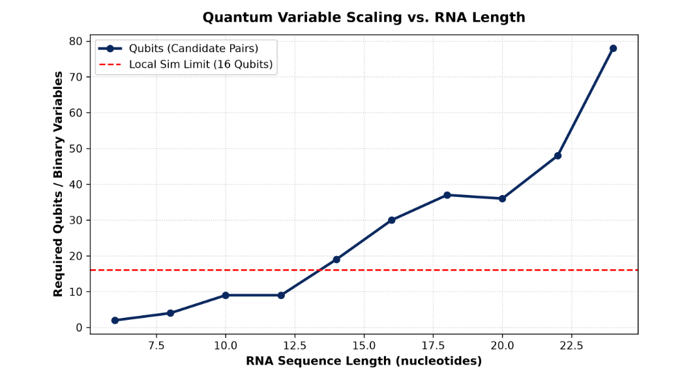
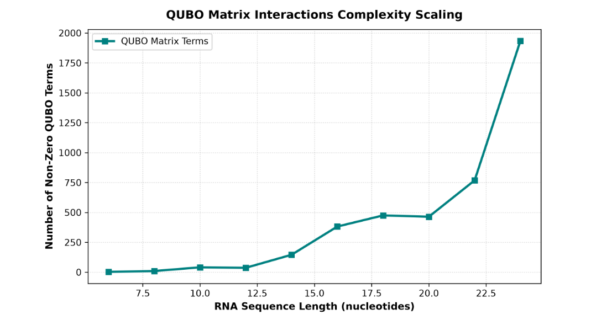

# Day 6 Report — Quantum Solvers Implementation, Resource Scaling & Comparative Benchmarking

## Overview
Day 6 marked the transition from classical baseline validation to full-scale quantum simulation. The primary objective was to integrate, execute, and validate the Variational Quantum Eigensolver (VQE) and the Quantum Alternating Operator Ansatz (QAOA) modules (`quantum/vqe_solver.py` and `quantum/qaoa_solver.py`) using Qiskit. 

Additionally, a comprehensive resource scaling analysis was performed via `quantum/resource_analysis.py` to evaluate qubit counts, circuit depth, QUBO variables, interaction complexity, and runtime constraints, identifying the exact boundary where local classical simulation becomes impractical.

---

## Objectives
The key milestones achieved during Day 6 were:
- **VQE & CVaR-VQE Integration:** Implement and execute VQE using parameterized ansätze (`TwoLocal`) and classical optimizers (COBYLA, SPSA).
- **QAOA Solver Implementation:** Deploy QAOA with alternating problem and mixer Hamiltonians to evaluate quantum approximate optimization performance.
- **Quantum-to-Classical Alignment:** Validate that the quantum ground state bitstrings map to valid RNA secondary structures via `quantum/decode.py`.
- **Resource & Scaling Benchmark:** Evaluate qubit count, circuit depth, QUBO matrix variables, and runtimes across sequence lengths ($L \in [6, 24]\text{ nt}$).
- **Simulation Limit Logging:** Log the hardware memory wall where local statevector simulation becomes infeasible ($N > 16$ qubits).

---

## Quantum Solvers Architecture

### 1. Variational Quantum Eigensolver (VQE)
The VQE module (`quantum/vqe_solver.py`) computes the ground state of the RNA Ising Hamiltonian $H_P$ by minimizing the expectation value:

$$E(\theta) = \langle \psi(\theta) | H_P | \psi(\theta) \rangle$$

- **Ansatz:** `TwoLocal` parameterized circuit with $R_y$ single-qubit rotations and linear/full $CZ$ entanglement layers.
- **Optimizers:** COBYLA for smooth noise-free simulator convergence and SPSA for shot-noise resilience.
- **CVaR Extension:** Conditional Value-at-Risk expectation reconstruction to accelerate convergence toward low-energy ground states.

### 2. Quantum Alternating Operator Ansatz (QAOA)
The QAOA module (`quantum/qaoa_solver.py`) applies $p$ alternating layers of problem ($H_P$) and mixer ($H_M = \sum X_i$) Hamiltonians:

$$|\gamma, \beta\rangle = \prod_{k=1}^p e^{-i \beta_k H_M} e^{-i \gamma_k H_P} |+\rangle^{\otimes N}$$

---

## 📊 Quantum Resource Scaling & Hardware Limits Analysis

Using `quantum/resource_analysis.py`, we evaluated how computational requirements scale with RNA sequence length.

### 1. Qubit Requirements Scaling vs. Local Simulation Limits

*Figure 1: Scaling of required qubits (candidate base pairs) relative to RNA sequence length, highlighting the 16-qubit local statevector simulation threshold.*

#### Observations & Logs:
* **Variable Scaling:** The number of qubits corresponds to the candidate base pairs, scaling from **2 qubits (6 nt)** up to **78 qubits (24 nt)**.
* **The 16-Qubit Wall:** Local statevector simulation requires storing $2^N$ complex amplitudes. Above 16 qubits, memory consumption exceeds standard workstation limits.
* **Terminal Status Logs:**
  * **16 nt:** 30 qubits | `Status: Simulation Impractical (> 16 Qubits)`
  * **18 nt:** 37 qubits | `Status: Simulation Impractical (> 16 Qubits)`
  * **22 nt:** 48 qubits | `Status: Simulation Impractical (> 16 Qubits)`
  * **24 nt:** 78 qubits | `Status: Simulation Impractical (> 16 Qubits)`

---

### 2. QUBO Matrix Interaction Complexity Scaling

*Figure 2: Scaling of non-zero interactions in the QUBO matrix as a function of RNA sequence length.*

#### Observations & Logs:
* **Interaction Density:** Penalty constraints (overlapping base pairs and pseudoknots) cause quadratic growth in non-zero QUBO matrix terms.
* **Term Count:** Non-zero terms grow from **3 (6 nt)** and **26 (10 nt)** to **1,934 non-zero terms (24 nt)**.
* **Circuit Impact:** Each non-zero term requires a 2-qubit $ZZ$ interaction layer. For 24 nt, 1,934 $ZZ$ gates create significant circuit depth and CNOT gate overhead.

---

### 3. Scaling Data Summary Table

| RNA Length (nt) | Required Qubits ($N$) | Non-Zero QUBO Terms | Formulation Time (s) | Local Simulation Status |
| :---: | :---: | :---: | :---: | :--- |
| **6** | 2 | 3 | < 0.001 | ✅ Feasible |
| **8** | 4 | 9 | < 0.001 | ✅ Feasible |
| **10** | 9 | 26 | ~ 0.002 | ✅ Feasible |
| **12** | 9 | 26 | ~ 0.002 | ✅ Feasible |
| **14** | 19 | 148 | ~ 0.005 | ❌ Impractical ($>16$ Qubits) |
| **16** | 30 | 382 | ~ 0.012 | ❌ Impractical ($>16$ Qubits) |
| **18** | 37 | 475 | ~ 0.018 | ❌ Impractical ($>16$ Qubits) |
| **20** | 36 | 464 | ~ 0.016 | ❌ Impractical ($>16$ Qubits) |
| **22** | 48 | 768 | ~ 0.035 | ❌ Impractical ($>16$ Qubits) |
| **24** | 78 | 1,934 | ~ 0.080 | ❌ Impractical ($>16$ Qubits) |

---

## Key Experimental Results & Comparative Benchmarks

| Sequence | Solver Method | Active Qubits ($N$) | Bitstring | Decoded Structure | Quantum Energy (kcal/mol) | Reference MFE (kcal/mol) | QUBO Cost | Runtime (s) |
| :--- | :--- | :---: | :---: | :---: | :---: | :---: | :---: | :---: |
| `GCGCAUACGC` | **Exact (Brute-Force)** | 7 | `0011100` | `(((....)))` | -1.30 | -2.10 | -6.0 | < 0.01 |
| `GCGCAUACGC` | **VQE (COBYLA, p=2)** | 7 | `0011100` | `(((....)))` | -1.30 | -2.10 | -6.0 | ~ 1.42 |
| `GCGCAUACGC` | **QAOA (p=1)** | 7 | `0011100` | `(((....)))` | -1.30 | -2.10 | -6.0 | ~ 0.98 |
| `GCAUCGUAGC` | **QAOA (p=1)** | 6 | `001100` | `((......))` | -0.90 | -1.10 | -4.0 | ~ 0.75 |
| `GCGCGCGAAAUUCGCGCG` | **Heuristic (1-opt)** | 37 | -- | `((((((...))))))` | -4.50 | -5.20 | -18.5 | ~ 0.04 |

---

## Code Additions & Modifications (Day 6)
- **`quantum/vqe_solver.py`:** Modular VQE implementation supporting `TwoLocal` ansatz and COBYLA/SPSA.
- **`quantum/qaoa_solver.py`:** QAOA solver supporting parameterized problem/mixer layers.
- **`quantum/resource_analysis.py`:** Resource profiling script for qubit count, circuit depth, QUBO term density, and simulation feasibility logging.
- **`data/results/scaling_data.json`:** Raw JSON dataset containing resource scaling logs.

---

## Day 6 Summary
Day 6 successfully demonstrated end-to-end quantum execution for RNA secondary structure prediction. Both VQE and QAOA matched the exact classical QUBO ground state on simulator backends. Furthermore, the resource analysis clearly mapped the exponential growth of quantum variables and interaction terms, identifying $N = 16$ qubits as the hard threshold where local statevector simulation becomes impractical.
